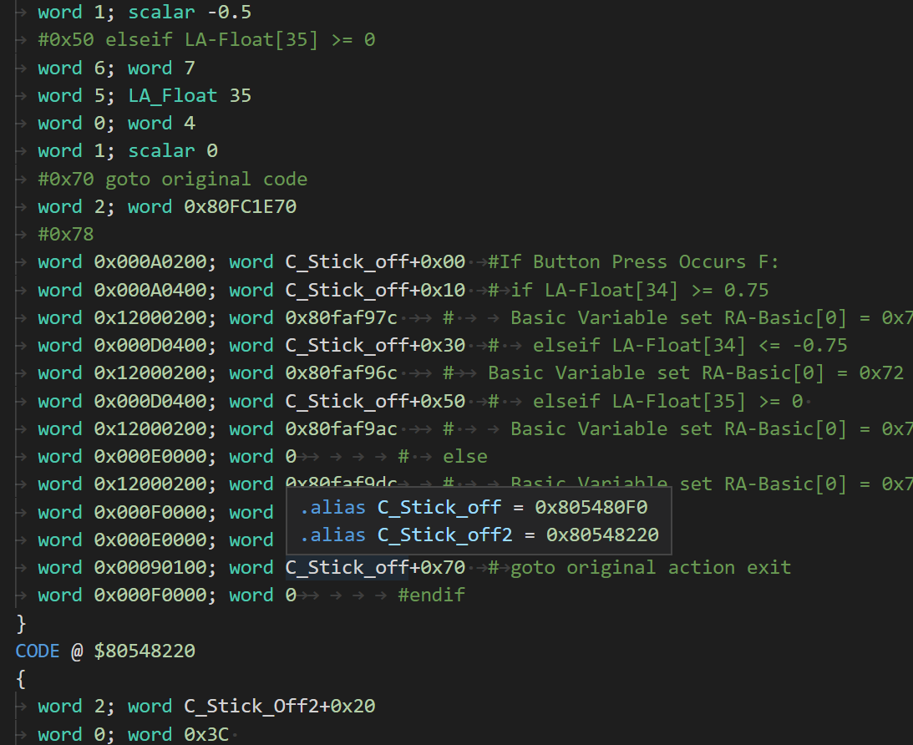

# Current Features:

## Autocompletion for Mnemonics

autocompletion for *MOST* of the mnemonics, along with their arguments. More to come later. Each mnemonic should also have some documentation with it.

## Jump To Definition

jump to definition (by ctrl+clicking on something using a label/alias/macro name)

## Context-Aware, Semantic Autocompletion

context-aware autocompletion for macros and their arguments as well as aliases

## Hover Documentation for Arguments

hovering on arguments given by the autocompletion will give you documentation about that argument type

## Auto-Formatting

By opening the command palette with `Ctrl+Shift+P`, you can choose to
automatically format the document with GCTRM-specific formatting. This effectively
allows you to copy/paste ASM directly from this particular output of
[godbolt compiler explorer](https://godbolt.org/z/E57_fg), format it, and hopefully have it run in your own code.

If you want to format only specific lines, you can do that too! just select
the lines you wish to modify and *then* use the command.

# Additions:

- **added the ability to load map files**
  - you can hover over addresses (`$hexvalues`) to see the previous mapped function
  - you now have autocompletion when writing addresses (though it might take a moment to appear)
- added autocompletion of labels

# Reporting Issues

head over to the github page or contact me on discord: `fudgepop01#0448`