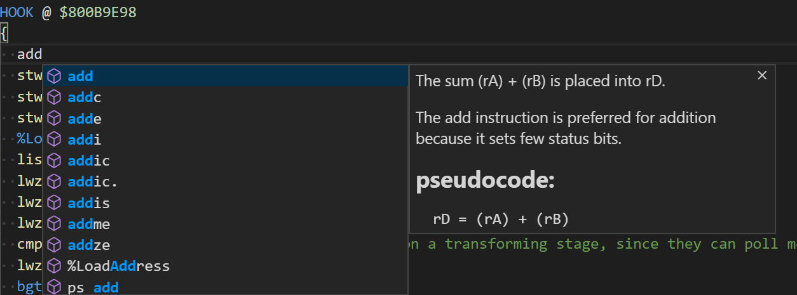
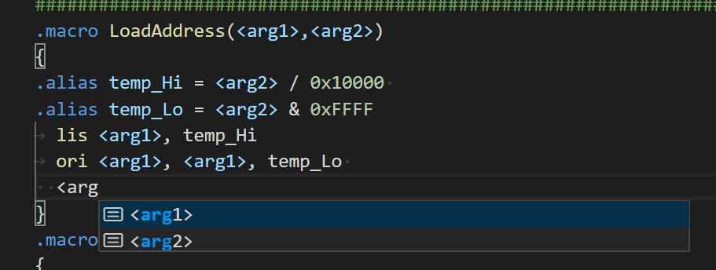

# Current Features:

## Autocompletion for Mnemonics

autocompletion for *MOST* of the mnemonics, along with their arguments. More to come later. Each mnemonic should also have some documentation with it.

## Jump To Definition

jump to definition (by ctrl+clicking on something using a label/alias/macro name)

## Context-Aware, Semantic Autocompletion

context-aware autocompletion for macros and their arguments as well as aliases

## Hover Documentation for Arguments

hovering on arguments given by the autocompletion will give you documentation about that argument type

# Reporting Issues

head over to the github page or contact me on discord: `fudgepop01#0448`