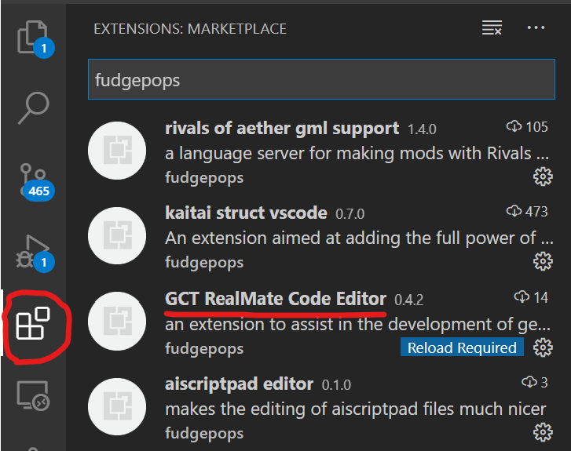
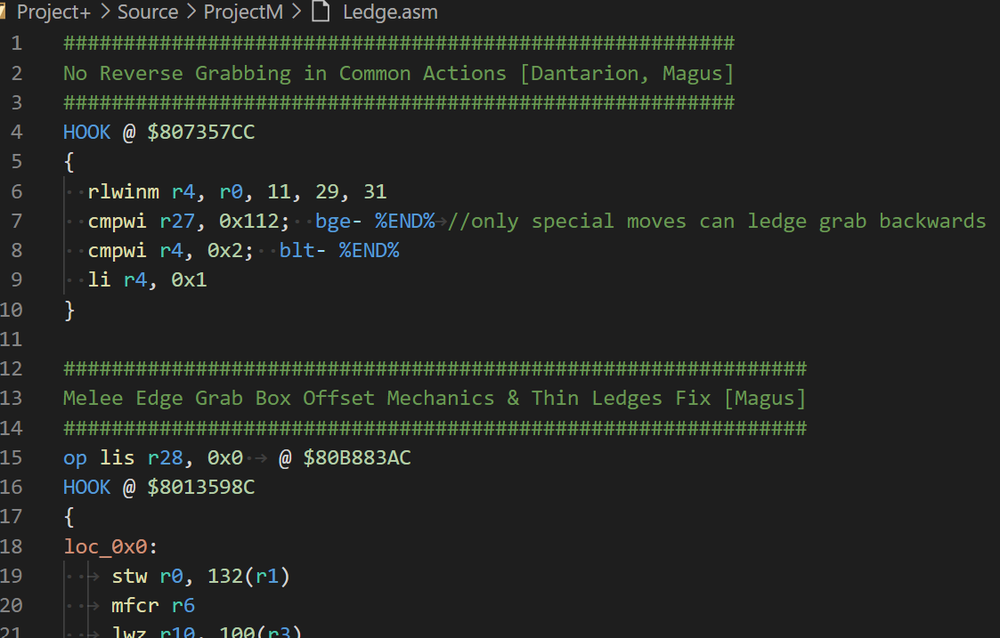
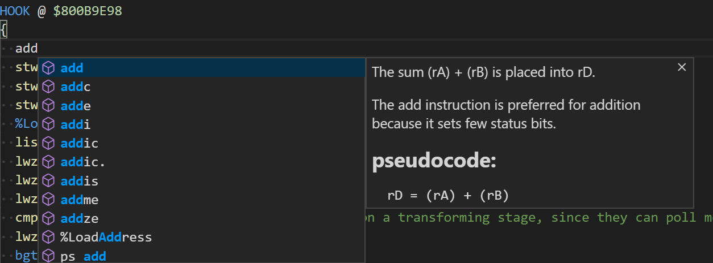
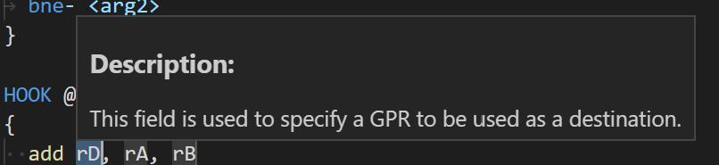
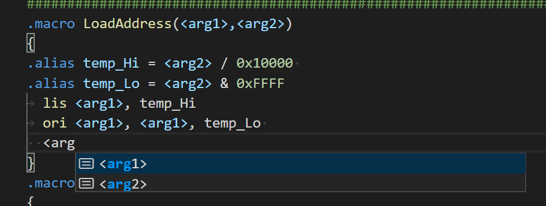
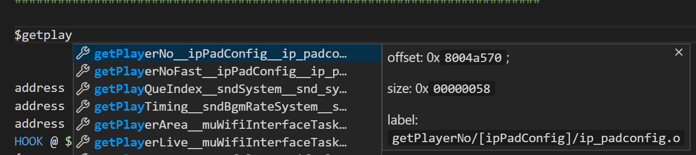
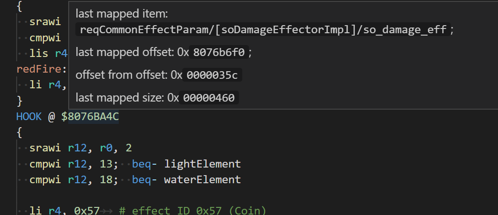
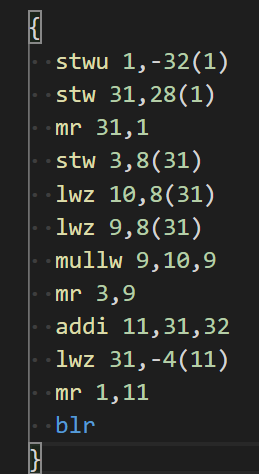
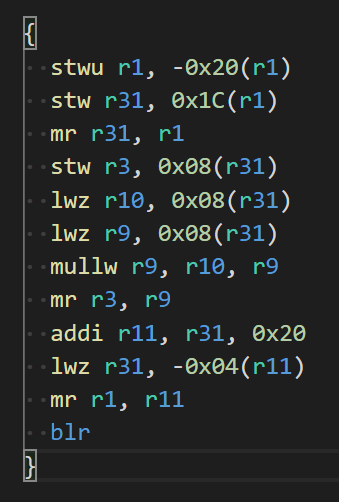

# Hello Newcomers!!

This is a guide written by fudgepop01 that will hopefully tell you exactly how to
setup and use this extension.

## What this guide will NOT do

- teach you how powerpc ASM / assembly works
- tell you where to get a Brawl ISO

## What this guide WILL do

- teach you how to set up this extension and use its various features
- give you my current understanding of how the GCTRealMate-based  `.asm` files work

---

Alrighty - with that outta the way, lets get started.

## Setting Up Visual Studio Code

1. head over to `https://code.visualstudio.com/` and download the editor
2. install the editor if necessary
3. open up visual studio code
4. add the extension
   1. on the left side of the screen you should see the toolbar
   2. open up the extensions panel by clicking on the icon that looks like 3 blocks with a
      fourth coming in from the top
   3. in the search bar, type in "fudgepops"
   4. click install on the GCT RealMate Code Editor extension



With that, congratulations - vscode is installed and so is the extension!

## Getting the Modding Tools

Everything you need to mod brawl can be found within the `offline/wii` zip file downloadable
on the [Project+ Website](https://projectplusgame.com/download/). This contains Project+,
but it also contains the tools and codes used to build the codeset.

Upon downloading the zip file, unzip it and navigate to the `Project+` folder. The files
and folders we're interested in are
- `credits.txt`
  - (because you should love everyone who contributed to this project)
- `RSBE01.txt`
  - the main codeset
- `BOOST.txt`
  - more codes
- `GCTRealMate.exe`
  - drag `RSBE01.txt` and `BOOST.txt` onto this to generate a codeset (`.GCT` file)
- `GCTRM-Log.bat`
  - drag `RSBE01.txt` and `BOOST.txt` onto this to generate a codeset AND a log file
  - might be useful for debugging your syntax or something idk
- Everything in the `Source` folder
  - contains the actual source gctrm-based asm files used for many codes
  - these get included in `RSBE01.txt` or `BOOST.txt` via include statements


## Using the Extension

### Syntax Highlighting

open up one of the `.asm` files in the `Source` folder. If the extension was installed
properly, everything should be filled with color (this may vary depending on your installed
color-theme):



### ASM Autocompletion / Hover Documentation

if you press `Ctrl + Space`, you'll bring up the autocomplete suggestion list.
This should show you each and every asm instruction along with some documentation.

This will also appear if you type stuff.



Once you choose one, press `enter` or `tab` and it'll fill in the asm code along with
the arguments. You can press `tab` to move through these arguments automatically. If you hover
over an argument before you do anything to it, you'll get some information about how it works
and what it does.



### Context-Aware Autocompletion

There's also smart autocompletion that will show you what labels, arguments, aliases,
and macros you currently have access to at that point in the file.



### Map File Loading

Another useful feature that exists as of `[0.4.2]` is autocompletion and hover
documentation for addresses by using a map file. If you don't know what this is,
don't worry about it too much you'll learn as you gain more experience.

One map file is already built-in anyway (`sora_melee.map`), but if you want to load
your own instead you can configure it in the settings. To do this:

1. click on the gear in the bottom-left corner ofthe screen
2. open settings
3. search up "gctrm"
4. in the option that appears, direct it to your map file.
  - this can be a relative path (dependant on the workspace root)
  - or an absolute path
  - to set it back to default, set it to "internal"

With dolphin-based map files you gain access to a few more features such as size
and the ability to use spaces in your label names.

What map files do is allow you to hover over addresses or bring up autocompletion for
them (when you type `$`).

**Autocomplete:**



**Hover documentation:**



### Auto Formatting / Using Compiler Explorer

Finally, there's auto-formatting. Select some code (or don't, if you want to auto-format
the whole file) and then press `ctrl + shift + p` to bring up the command palette.
Type "format gctrm" and choose the menu option of the same name. Boom!

It should have formatted some code. This *also* just-so happens to format code that's
copy/pasted from the godbolt compiler explorer.

Go to this url: `https://godbolt.org/z/E57_fg`

Then copy/paste the asm from the right side into the editor:



This won't work properly when run through GCTRM. *however*, when you select it
and auto-format it...



Boom! It gets converted into a form that GCTRM understands!

#### That's all the features! (for now)

---

## Creating the Codeset

1. First be sure to write an `.include` statement somewhere in the `RSBE01.txt` file,
  directing it to the location of your `.asm` file.
2. click and drag the `RSBE01.txt` directly onto `GCTRealMate.exe`. This should generate
  a new `RSBE01.GCT` file. If you want logs, drag it onto `GCTRealMate-Log.exe` instead
  and it'll generate a `log.txt` file along with it.

Once that's done, you should be good to go if I'm not mistaken! The RSBE01.GCT file
should get loaded by the wii/emulator, and if all went well, should have loaded your
mods too.

## About GCT RealMate (GCTRM)

GCTRM is an incredible coding language made by [DukeItOut](https://www.reddit.com/user/DukeItOut64).
It allows modders to write mods in gctrm instead of writing them as pure gecko codes. These
codes get converted into GCT files through Duke's program called `GCTRealMate` (explained above),
and these GCT files are what are actually read by the "wii" (technically a peripheral for the
wii called a USB gecko).

### GCTRM Documentation

There are a number of features in GCTRM. Here I'll go over the syntax of each of them
and explain what they do.

#### Shorthands used in this documentation

- `<address>`
  - stands for an address, which is a dollar sign followed by 8 hexadecimal digits
  - example: `$80762f9c`
- `<asm>`
  - where machine code instructions go
- `<instruction>`
  - where a **single** machine code instruction goes
- `<macro name>` and `<alias name>`
  - text that can contain a-z, 0-9, and underscores
- `<operation>`
  - really only used in `.alias`
  - theoretically allows you to perform an operation on an argument
  - includes standard arithmatic operators ( + - * / )
    along with boolean ones ( ^ | & ~ )
- `<type data>`
  - allows you to write a value into memory based on a type.
  - the types are as follows:
    - byte
      - 1 byte value
      - can be negative
    - half
      - 2 byte value
    - word
      - 4 byte value
    - int
      - 4 byte value
    - address
      - 4 byte value
      - just incase you wanted to write `$...` instead of `0x...`
    - float
      - 4 byte, floating-point number
      - these can have decimals.
      - can be negative
    - scalar
      - like a float, but different
      - use this only in PSA mods
-


#### HOOK

Synax:
```
HOOK @ <address>
{
  <asm> and/or <type data>
}
```

HOOKs are written in gecko's own internal memory. They will effectively "hook into"
an instruction at an address by making it so when the game reaches the code, it will
jump into and run the code in the HOOK, then jump back to where it was before.

#### CODE

Syntax:
```
CODE @ <address>
{
  <asm> and/or <type data>
}
```

Unlike a HOOK, CODE writes directly to an address. There is no jumping involved, whatever
is at the address specified is replaced with the code written in the CODE block.

#### PULSE

Syntax:
```
PULSE
{
  <asm>
  blr
}
```

PULSE is external code in gecko's own internal memory. It *usually* runs once every frame
depending on gecko's "hook type" (something which I don't have enough knowledge about to
explain right now).

these MUST end with a `blr` instruction.

#### op

Syntax:
```
op <instruction> @ <address>
```

effectively a 1-line CODE block

#### using types in one line

Syntax:
```
<type> <value> @ <address>
```

this is a 1-line CODE block that will write the specified `<type>` value at the address.

#### .macro

Syntax for **Creating**:
```
.macro <macro name>(<arg1>, <arg2>, ..., <argn>)
{
  <asm>
}
```

Syntax for **Calling**:
```
%<macro name>(<arg1>, <arg2>, ..., <argn>)
```

**arguments in the macro code blocks must have \<brackes\> around them**

macros are useful if there's a particular chunk of code that needs to be repeated multiple
times. These can be created and called upon later in the code to insert the macro's code
with whatever arguments you give it, wherever you put it.

#### .alias

Syntax for **Creating**:
```
.alias <alias name> = <value> or <operation>
```

an alias is kind of like a constant variable - one that doesn't change. You can redefine
them later on in the code, but they themselves cannot be manipulated. Use them
to help with readability and reduce tedium.

#### labels

Syntax:
```
...
{
label_inside_code_block:
}

label_outside_code_block:
```

labels are effectively named offsets in the code that you can jump to from branch
instructions or store as locations in various registers.

#### BA, PO

Syntax:
```
load into gecko Base Address register:
BA<-<address>
PO<-<address>

put contents of gecko Base Address register somewhere else:
BA-><address>
PO-><address>
```

some gecko commands implemented for a bit of clarity.

These will load things into the gecko Base Address or Pointer Address registers, as
well as set somewhere else

#### .RESET

Syntax:
```
.RESET
```

resets the gecko Base Address and Pointer Address to their initial values. BA will be
reset to `0x80000000` and PO will be reset to `0x90000000`.

In some cases this is critical to put at the end of the code to allow other
codes to function properly.

#### .GOTO

Syntax:
```
.GOTO-><label>
```

tells gecko to go to a particular part in the code. This is useful
for when a chunk of data is defined and you don't want to read it as commands.


## Definitions:

- **GCT RealMate (GCTRM)**
  - a tool built by [DukeItOut](https://www.reddit.com/user/DukeItOut64) to help assist in the
    development of super smash bros brawl gecko codes.
- **Gecko Codes**
  - Codes that are written for the purpose of adding hacks/mods to your wii.
  - interpreted and run on the wii via USB Gecko
- **USB Gecko**
  - the basis of many Super Smash Bros Brawl mods such as Project+
  - this is what interprets Gecko Codes and allows them to run on the wii in the first place

# That's all, Folks!

### Thank you so much for reading!

I hope you enjoy the extension, and I can't wait to see what you all make with it :3

This extension is 100% free, but if you'd like to support me, you can donate to my
ko-fi! (it's like patreon but for 1-time donations)

[](https://ko-fi.com/J3J8Y3EA)